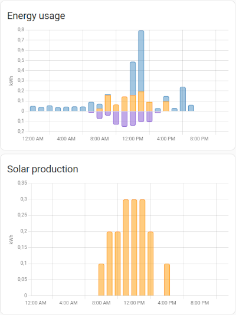
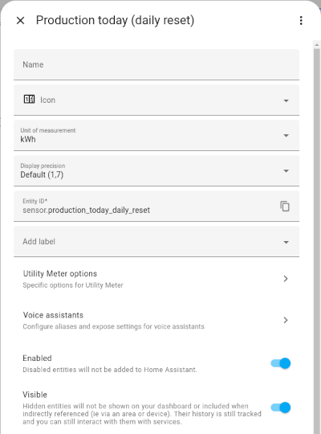
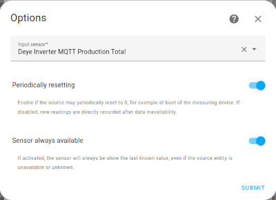

# Deye MQTT HA Plugin

## Introduction

This plugin connects your "Deye Solar Inverter MQTT Bridge" directly to Home Assistant, making it easy to automatically discover and use all the values published by your inverter.

With this integration, you can visualize your solar energy data right inside Home Assistant. Here’s an example of an energy usage diagram, powered by data from your Deye inverter:



You can also read and update the active power regulation feature (if enabled). Please note: reading and updating the "time of use" (ToU) configuration isn’t available yet.

Multi-inverter setups (`DEYE_LOGGER_COUNT > 0`) aren’t supported at this time.

## Requirements

* [Deye solar inverter MQTT bridge](https://github.com/kbialek/deye-inverter-mqtt), version 2024.11.1 or newer

## Installation

1. First, install the Deye Solar Inverter MQTT Bridge.

2. Next, update your `config.env` configuration file for the MQTT bridge. Add or adjust the following section to enable Home Assistant integration:

    ```bash
    # Home Assistant Integration
    # ==========================

    # NOTE: Do not use quotation marks around these values.

    # Enable this plugin
    PLUGINS_ENABLED=deye_plugin_ha_discovery

    # MQTT prefix for all topics published to Home Assistant
    DEYE_HA_PLUGIN_HA_MQTT_PREFIX=homeassistant

    # Inverter manufacturer
    DEYE_HA_PLUGIN_INVERTER_MANUFACTURER=<your manufacturer>

    # Inverter model
    DEYE_HA_PLUGIN_INVERTER_MODEL=<your inverter>

    # Topics not published to HA
    # Use : as separator, supports Unix shell-style wildcards *, ?, [seq] and
    # [!seq] as implemented with Python fnmatch,
    DEYE_HA_PLUGIN_IGNORE_TOPIC_PATTERNS=uptime:ac/relay_status:*/pv[234]/*

    # If the sensor value isn't updated for DEYE_HA_PLUGIN_EXPIRE_AFTER seconds, it'll expire / be
    # marked as "unavailable" in Home Assistant.
    # It must be greater than DEYE_DATA_READ_INTERVAL or DEYE_PUBLISH_ON_CHANGE_MAX_INTERVAL (if used)
    # If the value is not defined, sensor values never expire
    DEYE_HA_PLUGIN_EXPIRE_AFTER=600

    # Use MQTT topic instead of sensor name in unique_id
    # CAUTION:
    #   Activate this option for new installations only.
    #   It will break existing integration as it changes the unique_id of all sensors.
    #   New sensors will be created with the same name as the existing sensors. You can
    #   merge these sensors manually with db_maint.py.
    DEYE_HA_PLUGIN_USE_TOPIC_IN_UNIQUE_ID=yes
    ```

3. Install the plugin from the `plugins` directory. For details, see
   ["How to start the docker container with custom plugins"](https://github.com/kbialek/deye-inverter-mqtt#how-to-start-the-docker-container-with-custom-plugins).  
   Don’t forget to recreate the container after updating `config.env`—just restarting won’t apply your changes.

4. In Home Assistant, install the [Utility Meter](https://www.home-assistant.io/integrations/utility_meter/) integration.

5. Set up a Utility Meter helper to reset your daily production counter at midnight.  
   You can do this in your `configuration.yaml`:

    ```bash
    # Example configuration.yaml entry
    utility_meter:
      energy:
        name: "Production total (daily reset)"
        source: sensor.deye_inverter_mqtt_production_total
        cycle: daily
    ```

    Or use the graphical interface:

    

    

## Troubleshooting

1. Make sure your `deye-mqtt` container is running the required minimum version.

2. Check if the plugin loaded successfully:

    ```bash
    docker logs deye-mqtt
    ```

   After starting the container, you should see a message like:

    ```
    DeyePluginLoader - INFO - Loading plugin: 'deye_plugin_ha_discovery'
    ```

   If you don’t see this, double-check your plugin installation.

3. Look for errors in the `deye-mqtt` container logs.

   If needed, increase the logging detail in `config.env` by setting `LOG_LEVEL=DEBUG` and restart the container.

4. To inspect what’s being published to your MQTT broker, try a graphical tool like [MQTT Explorer](https://mqtt-explorer.com/).

## Resources

* [Project Page](https://carstengrohmann.de/deye-mqtt-ha-plugin.html)
* [Source Code](https://git.sr.ht/~carstengrohmann/deye-mqtt-ha-plugin)
  (also mirrored on [GitHub](https://github.com/CarstenGrohmann/deye-mqtt-ha-plugin))
* [Home Assistant](https://www.home-assistant.io/)
* [Deye solar inverter MQTT bridge](https://github.com/kbialek/deye-inverter-mqtt)

## Changelog

### 2025-04-17
* Plugin does not start if multi-inverter setup is active

### 2025-02-27
* Add support for the first binary_sensor - on/off-grid status (by [@daniel-deptula](https://github.com/daniel-deptula))
* Add support for the "expire_after" parameter for all sensors (by [@daniel-deptula](https://github.com/daniel-deptula))

### 2024-12-20
* Add support for SG01HP3 inverters by [@daniel-deptula](https://github.com/daniel-deptula)
* Add support for sensor device class "enum" by [@daniel-deptula](https://github.com/daniel-deptula)

### 2024-11-20
* Add support for active power regulation
* Internal code changes
* Use the new public API to create MQTT topic
  (requires [Deye solar inverter MQTT bridge](https://github.com/kbialek/deye-inverter-mqtt)
  at least version 2024.11.1)

### 2024-10-22
* Add device classes for total_energy_bought and daily_energy_sold

### 2024-10-03
* Fix the wrong unit for uptime sensor

### 2024-09-20
* README extended
* All energy topics use state class "total_increasing" now
* Add more MQTT topics

### 2024-08-30
* first release

## Known Bugs/Issues

Check out the project’s [issue tracker](https://todo.sr.ht/~carstengrohmann/deye-mqtt-ha-plugin)

## License

This project is licensed under the Apache 2.0 license.

> Copyright (c) 2024,2025 Carsten Grohmann, mail &lt;add at here&gt; carstengrohmann.de
>
> Licensed to the Apache Software Foundation (ASF) under one
> or more contributor license agreements.  See the NOTICE file
> distributed with this work for additional information
> regarding copyright ownership.  The ASF licenses this file
> to you under the Apache License, Version 2.0 (the
> "License"); you may not use this file except in compliance
> with the License.  You may obtain a copy of the License at
>
>   http://www.apache.org/licenses/LICENSE-2.0
>
> Unless required by applicable law or agreed to in writing,
> software distributed under the License is distributed on an
> "AS IS" BASIS, WITHOUT WARRANTIES OR CONDITIONS OF ANY
> KIND, either express or implied.  See the License for the
> specific language governing permissions and limitations
> under the License.

Enjoy!

Carsten Grohmann
