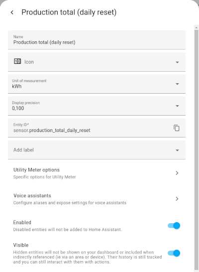

# Deye MQTT HA Plugin

## Introduction

This plugin provides a Home Assistant integration for all data published by the "Deye solar inverter MQTT bridge".

Energy usage diagram provided by Home Assistant filled with data from a "Deye solar inverter MQTT bridge":


## Installation

1. Install Deye solar inverter MQTT bridge

2. Extend the Deye solar inverter MQTT bridge configuration file `config.env` like described in this example:

    ```bash
    # Home Assistant Integration
    # ==========================
    PLUGINS_ENABLED=deye_plugin_ha_discovery
    DEYE_HA_PLUGIN_HA_MQTT_PREFIX=homeassistant
    DEYE_HA_PLUGIN_INVERTER_MANUFACTURER=<your manufacturer>
    DEYE_HA_PLUGIN_INVERTER_MODEL=<your inverter>
    # Topics not published to HA
    # Use : as separator, supports Unix shell-style wildcards *, ?, [seq] and
    # [!seq] as implemented with Python fnmatch,
    DEYE_HA_PLUGIN_IGNORE_TOPIC_PATTERNS=settings/active_power_regulation:uptime:*/pv[234]/*
    ```

3. Install the plugin from `plugins` directory as described in ["How to start the docker container with custom plugins"](https://github.com/kbialek/deye-inverter-mqtt#how-to-start-the-docker-container-with-custom-plugins)

4. Switch to the Home Assistant and install [Utility Meter](https://www.home-assistant.io/integrations/utility_meter/)

5. Configure a Utility Meter helper to reset the daily production counter at midnight.

    ```bash
    # Example configuration.yaml entry
    utility_meter:
      energy:
        name: "Production today (daily reset)"
        source: sensor.deye_inverter_mqtt_production_today
        cycle: daily
    ```
   
    or graphically 
 
    

    

## Requirements

* [Deye solar inverter MQTT bridge](https://github.com/kbialek/deye-inverter-mqtt) 2024.07.1

## Resources

* [Project Page](https://carstengrohmann.de/deye-mqtt-ha-plugin.html)
* [Source Code](https://git.sr.ht/~carstengrohmann/deye-mqtt-ha-plugin)
  (mirrored on [GitHub](https://github.com/CarstenGrohmann/deye-mqtt-ha-plugin))
* [Home Assistent](https://www.home-assistant.io/)
* [Deye solar inverter MQTT bridge](https://github.com/kbialek/deye-inverter-mqtt)

## Known Bugs/Issues

Check the project [issue tracker](https://todo.sr.ht/~carstengrohmann/deye-mqtt-ha-plugin)
for current open bugs. New bugs can be reported there also.

## License

This project is licensed under the Apache 2.0 license.

> Copyright (c) 2024 Carsten Grohmann,  mail &lt;add at here&gt; carstengrohmann.de
>
> Licensed to the Apache Software Foundation (ASF) under one
> or more contributor license agreements.  See the NOTICE file
> distributed with this work for additional information
> regarding copyright ownership.  The ASF licenses this file
> to you under the Apache License, Version 2.0 (the
> "License"); you may not use this file except in compliance
> with the License.  You may obtain a copy of the License at
>
>   http://www.apache.org/licenses/LICENSE-2.0
>
> Unless required by applicable law or agreed to in writing,
> software distributed under the License is distributed on an
> "AS IS" BASIS, WITHOUT WARRANTIES OR CONDITIONS OF ANY
> KIND, either express or implied.  See the License for the
> specific language governing permissions and limitations
> under the License.

Enjoy!

Carsten Grohmann
